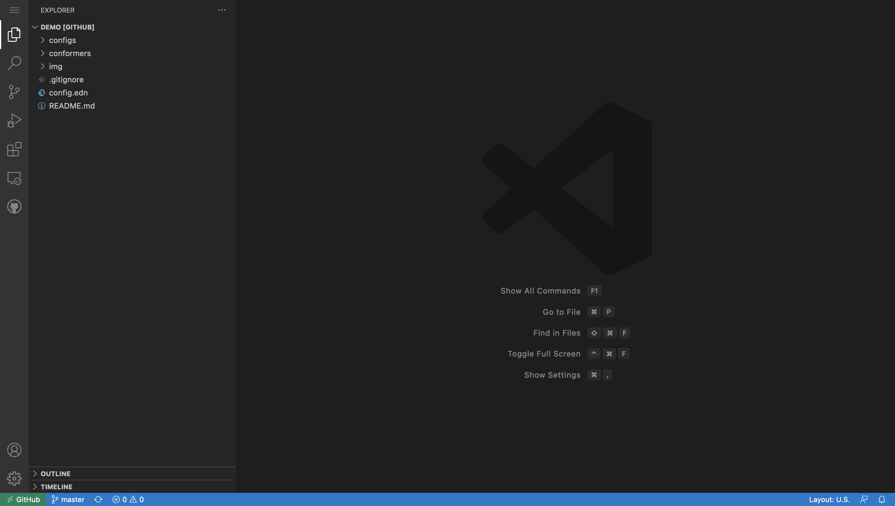
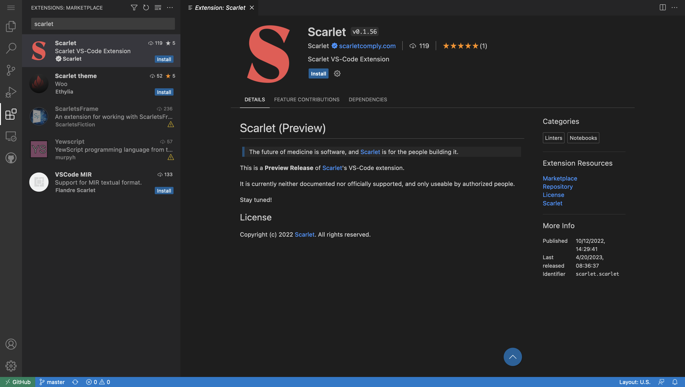
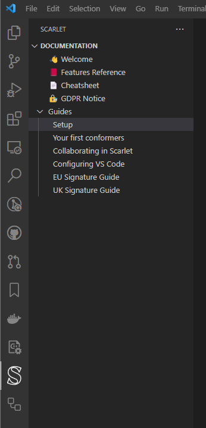

# Scarlet Repository

Welcome to your Scarlet repository!

- [Scarlet Repository](#scarlet-repository)
  - [Quick Setup](#quick-setup)
    - [Scarlet on Web](#scarlet-on-web)
    - [Scarlet on Desktop](#scarlet-on-desktop)
  - [Documentation](#documentation)
  - [Useful links](#useful-links)
    - [Demo](#demo)
  - [Keyboard Shortcuts](#keyboard-shortcuts)

## Quick Setup

This provides the steps to get access to Scarlet on the Web.

### Scarlet on Web

To access Scarlet on Web, you will use [vscode.dev](https://vscode.dev), which is an online version of the text and code editing tool Visual Studio Code, created by Microsoft.

For the purposes of these instructions, we will imagine that your repository is called `demo`.

Access your repo by going to [vscode.dev/github/scarletcomply/demo](https://vscode.dev/github/scarletcomply/demo).

Click the Extensions icon in the sidebar and type "scarlet" into the search box. Find the Scarlet extension and click Install.

Now click on the Scarlet icon in the sidebar. The extension will then take a few seconds to load, and you will see the sidebar populate with lists of Workflows and Specs.

You are now ready to use Scarlet!

### Scarlet on Desktop

For the instruction to set up Scarlet locally, see the "Guides > Setup" in the [Documentation](#documentation).

## Documentation

The documentation is available directly in the Scarlet extension in the "Documentation" Panel.

## Useful links

### Demo

The [Demo repository](https://github.dev/scarletcomply/demo) is a repository where you can see the whole Scarlet system and explore what is beyond the specs accessible during the orientation week.

*Disclaimer:* The version of the demo repository might not be the same as your current repository, therefore, you might see small differences between the two states.

## Keyboard Shortcuts

- Renaming conformers: `F2` on the title, i.e. the H1.
- Open the code actions in a link field: `cmd/ctrl+.`
- Open the command palette: `cmd/ctrl+shift+p` or `F1`
- Follow a link: `cmd/ctrl+click`
- Autocomplete: `cmd/ctrl+space`
